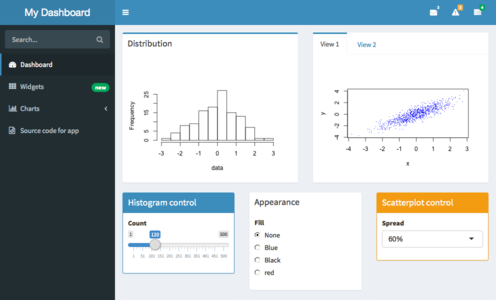

# Planificar una visualización de datos
Antes, aprendiste que la **visualización de datos** es la representación gráfica de la información. Como analista de datos, te interesará crear visualizaciones que hagan que tus datos sean fáciles de entender e interesantes para observar. Debido a la importancia de la visualización de datos, la mayoría de las herramientas de análisis de datos (como hojas de cálculo y bases de datos) tienen un componente de visualización integrado, mientras que otras (como Tableau) se especializan en la visualización como su principal valor agregado. En esta lectura, explorarás los pasos que implica el proceso de visualización de datos y algunas de las herramientas de visualización de datos más comunes disponibles. 

## Pasos para planificar una visualización de datos
Veamos un ejemplo de una situación de la vida real en la que un analista de datos podría necesitar crear una visualización de datos para compartir con los interesados. Imagina que eres un analista de datos que trabaja para un distribuidor de ropa. La compañía ayuda a las pequeñas tiendas de ropa a administrar su inventario, y las ventas están en auge. Un día, te enteras de que tu compañía se está preparando para hacer una actualización importante en su sitio web. Para guiar las decisiones relativas a la actualización del sitio web, se te pide que analices los datos del sitio web existente y de los registros de ventas. Revisemos los pasos que deberías seguir. 

### Paso 1: Explora los datos en busca de patrones
Primero, le pides a tu gerente o al propietario de los datos acceso a los registros de ventas actuales y a los informes de análisis del sitio web. Esto incluye información sobre cómo se comportan los clientes en el sitio web existente de la compañía; es decir, información básica sobre quiénes lo visitaron, quiénes compraron en la compañía y cuánto compraron.

Mientras revisas los datos, observas un patrón entre las personas que visitan el sitio web de la empresa con mayor frecuencia: la geografía y mayores cantidades de dinero invertido en compras. Si se realiza un análisis más detallado, esta información podría explicar por qué las ventas son tan fuertes en este momento en el noreste y ayudar a tu compañía a encontrar nuevas formas de continuar mejorándolas a través del nuevo sitio web. 

### Paso 2: Planifica tus imágenes
A continuación, llegó la hora de refinar los datos y presentar los resultados de tu análisis. En este momento, tienes muchos datos distribuidos en varias tablas, y esta no es la mejor manera de compartir tus resultados con la administración y el equipo de Marketing. Probablemente, te interesará crear una visualización de datos que explique los resultados a tu público objetivo de una forma rápida y efectiva. Como sabes que tu público está orientado a las ventas, eres consciente de que la visualización de datos que uses debería tener estas características:

- Mostrar números de ventas a lo largo del tiempo

- Conectar las ventas con la ubicación

- Mostrar la relación entre las ventas y el uso del sitio web

- Mostrar qué clientes impulsan el crecimiento

### Paso 3: Crea tus imágenes
Como ya decidiste qué tipo de información y perspectivas deseas mostrar, es hora de empezar a crear las visualizaciones reales. Ten en cuenta que crear la visualización correcta para una presentación o para compartir con los interesados es un proceso. Este proceso consiste en probar diferentes formatos de visualización y hacer ajustes hasta conseguir lo que estás buscando. En este caso, una combinación de diferentes imágenes comunicará mejor tus resultados y convertirá tu análisis en una historia más atractiva para los interesados. Por lo tanto, puedes usar las capacidades de diagrama que están incorporadas en tus hojas de cálculo para organizar los datos y crear imágenes.

1. los gráficos de líneas pueden rastrear las ventas a lo largo del tiempo; 
2. los mapas pueden conectar las ventas con las ubicaciones; 
3. los gráficos de donas pueden mostrar segmentos de clientes, y 
4. los gráficos de barras pueden comparar el total de visitantes que realizan una compra.

## Crea tu kit de herramientas de visualización de datos
Hay muchas herramientas que puedes usar en la visualización de datos. 

- Puedes usar las herramientas de visualización de tu hoja de cálculo para crear visualizaciones simples, como gráficos de líneas y barras.

- Puedes usar herramientas más avanzadas, como Tableau, que te permiten integrar datos en visualizaciones de estilo de panel. 

- Si estás trabajando con el lenguaje de programación R, puedes usar las herramientas de visualización en RStudio.

Tu elección de visualización dependerá de varios factores, incluidos el tamaño de tus datos y el proceso que usaste para analizarlos (hoja de cálculo, bases de datos/consultas o lenguajes de programación). Por ahora, solo considera los conceptos básicos. 

## Hojas de cálculo (Microsoft Excel o Google Sheets)
En nuestro ejemplo, los diagramas y gráficos integrados en las hojas de cálculo facilitaron y aceleraron el proceso de creación de imágenes. Las hojas de cálculo son excelentes para crear visualizaciones simples, como gráficos de barras y de torta, e incluso proporcionan algunas visualizaciones avanzadas, como mapas y diagramas de cascada y embudo (que se muestran en las siguientes figuras).

Pero, a veces, necesitas una herramienta más poderosa para darles realmente vida a tus datos. Tableau y RStudio son dos ejemplos de plataformas muy usadas que pueden ayudarte a planificar, crear y presentar visualizaciones de datos efectivas y atractivas.

## Software de visualización (Tableau)
Tableau es una herramienta de visualización de datos popular que te permite extraer datos de casi cualquier sistema y convertirlos en imágenes atractivas o información procesable. La plataforma ofrece las mejores prácticas visuales integradas, lo que hace que analizar y compartir datos sea más rápido, fácil y (lo más importante) útil. Tableau funciona bien con una amplia variedad de datos, e incluye un panel interactivo que les permite tanto a ti como a tus interesados hacer clic para explorar los datos de forma interactiva. 

 
Puedes comenzar a explorar Tableau en los recursos de 
[Video instructivo](https://public.tableau.com/en-us/s/resources)
. Tableau Public es gratuito, fácil de usar y contiene mucha información útil. La página Recursos es una ventanilla única para videos instructivos, ejemplos y conjuntos de datos con los cuales puedes practicar. Si deseas ver lo que otros analistas de datos comparten en Tableau, visita la página [Visualización del día](https://public.tableau.com/en-us/gallery/?tab=viz-of-the-day&type=viz-of-the-day), donde encontrarás hermosas imágenes que varían desde la [Búsqueda de planetas (habitables)](https://public.tableau.com/en-us/gallery/hunt-habitable-planets?tab=viz-of-the-day&type=viz-of-the-day) hasta [Quién habla en películas populares](https://public.tableau.com/en-us/gallery/whos-talking-popular-films?tab=viz-of-the-day&type=viz-of-the-day).

## Lenguaje de programación (R con RStudio) 
Muchos analistas de datos trabajan con un lenguaje de programación llamado R. La mayoría de las personas que trabajan con R también terminan usando RStudio, un entorno de desarrollo integrado (IDE), para satisfacer sus necesidades de visualización de datos. Al igual que con Tableau, puedes crear visualizaciones de datos de estilo panel con RStudio.

Visita su sitio webpara obtener más información sobre [RStudio](https://rstudio.com/).

Seguramente, pasarías días explorando todos los recursos que se proporcionan en RStudio.com, pero las [Hojas de referencia de RStudio](https://rstudio.com/resources/cheatsheets/) y la 
[Guía de iniciación a la visualización de datos de RStudio](https://rstudio.cloud/learn/primers/3) son excelentes lugares para empezar. Cuando tengas más tiempo, consulta los videos y seminarios web que ofrecen consejos y perspectivas útiles para usuarios principiantes y avanzados.

## Conclusión clave
Los mejores analistas de datos usan una gran variedad de herramientas y métodos para visualizar y compartir sus datos. A medida que vayas aprendiendo más sobre la visualización de datos durante este curso, mantén la curiosidad, investiga diferentes opciones y prueba continuamente nuevos programas y plataformas que te ayuden a aprovechar tus datos al máximo. 