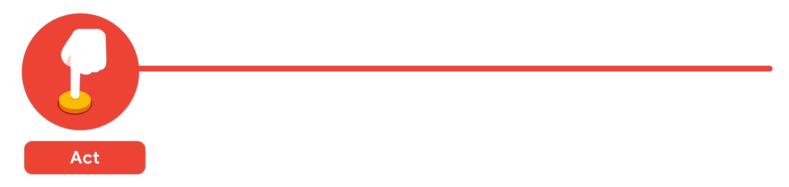

# Del problema a la acción: las seis fases del análisis de datos
Hay seis fases de análisis de datos que te ayudarán a tomar decisiones fluidas: preguntar, preparar, procesar, analizar, compartir y actuar. Ten en cuenta que estas no son lo mismo que el ciclo de vida de los datos, que describe los cambios que experimentan los datos a lo largo de su vida útil. Repasemos los pasos para ver cómo pueden ayudarte a resolver los problemas que podrías enfrentar en el trabajo.

### Paso 1: preguntar
Es imposible resolver un problema si no sabes de qué se trata. Estas son algunas cosas a tener en cuenta:

- Define el problema que tratas de resolver

- Asegúrate de entender completamente las expectativas de los interesados

- Concéntrate en el problema real y evita las distracciones

- Colabora con los interesados y mantén una línea de comunicación abierta

- Da un paso atrás y observa toda la situación en contexto

#### Preguntas que debes hacerte en este paso:
- ¿Qué problemas dicen tener mis interesados?

- Ahora que identifiqué los problemas, ¿cómo puedo ayudar a los interesados a resolver sus preguntas?

### Paso 2: preparar 
Decidirás qué datos necesitas recopilar para responder a sus preguntas y cómo organizarlos para que sean útiles. Puedes utilizar tu tarea empresarial para decidir: 

- Que métricas medir

- Localizar datos en tu base de datos

- Crear medidas de seguridad para proteger esos datos

#### Preguntas que debes hacerte en este paso: 
- ¿Qué necesito para descubrir cómo resolver este problema?

- ¿Qué investigación debo hacer?

### Paso 3: procesar
Los datos limpios son los mejores datos y deberás limpiar los datos para deshacerte de posibles errores, inexactitudes o incoherencias. Esto puede implicar lo siguiente:

- Usar funciones de las hojas de cálculo para encontrar datos ingresados incorrectamente

- Usar funciones SQL para buscar espacios adicionales

- Eliminar entradas repetidas

- Comprobar tanto como sea posible el sesgo en los datos

#### Preguntas que debes hacerte en este paso: 
- ¿Qué errores o inexactitudes de datos pueden interponerse en mi camino para obtener la mejor respuesta posible al problema que trato de resolver?

- ¿Cómo puedo limpiar mis datos para que la información que tengo sea más coherente?

### Paso 4: analizar 
Deberías pensar analíticamente sobre tus datos. En esta etapa, puedes ordenar y formatear tus datos para que sea más fácil hacer lo siguiente: 

- Realizar cálculos

- Combinar datos de varias fuentes

- Crear tablas con los resultados

#### Preguntas que debes hacerte en este paso:
- ¿Qué historia me cuentan los datos?

- ¿Cómo me ayudarán los datos a resolver este problema?

- ¿Quién necesita el producto o servicio de mi empresa? ¿Qué tipo de persona es más probable que lo use?

### Paso 5: compartir
Todos comparten sus resultados diferente, así que asegúrate de resumir los resultados con imágenes claras y atractivas de tu análisis usando herramientas de visualización de datos como los gráficos o los paneles. Esta es tu oportunidad de mostrarles a los interesados que resolviste su problema y cómo lo hiciste. Sin duda, compartir ayudará a tu equipo a hacer lo siguiente: 

- Tomar mejores decisiones

- Tomar decisiones más informadas

- Conseguir resultados más sólidos

- Comunicar con éxito los hallazgos

#### Preguntas que debes hacerte en este paso:
- ¿Cómo puedo hacer que lo que presento a los interesados sea atractivo y fácil de entender?

- ¿Qué me ayudaría a entender esto si yo fuera el oyente?

### Paso 6: actuar
Ahora es el momento de actuar sobre los datos. Tomarás todo lo que has aprendido del análisis de datos y lo pondrás en práctica. Esto podría significar brindarles a los interesados recomendaciones basadas en los hallazgos para que puedan tomar decisiones basadas en datos.

#### Preguntas que debes hacerte en este paso:
- ¿Cómo puedo utilizar los comentarios que recibí durante la fase compartir (paso 5) para satisfacer realmente las necesidades y expectativas de los interesados?

Estos seis pasos pueden ayudarte a dividir el proceso de análisis de datos en partes más pequeñas y manejables, lo que se denomina pensamiento estructurado. Este proceso involucra cuatro actividades básicas:

1. Reconocer el problema o la situación actuales

2. Organizar la información disponible 

3. Revelar déficits y oportunidades

4. Identificar tus opciones

Cuando empiezas tu carrera como analista de datos, es normal sentirte desviado en diferentes direcciones por tu función y tus expectativas. Seguir procesos como los que se describen aquí y usar habilidades de pensamiento estructurado pueden ayudar a volver a encarrilarte, superar cualquier inconveniente y hacerte saber exactamente lo que necesitas.